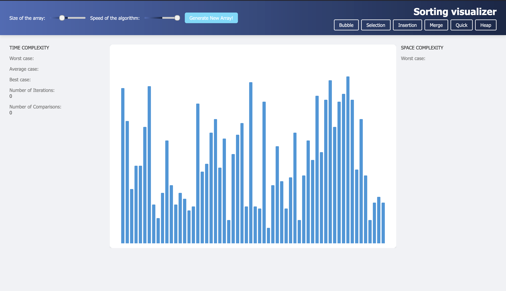
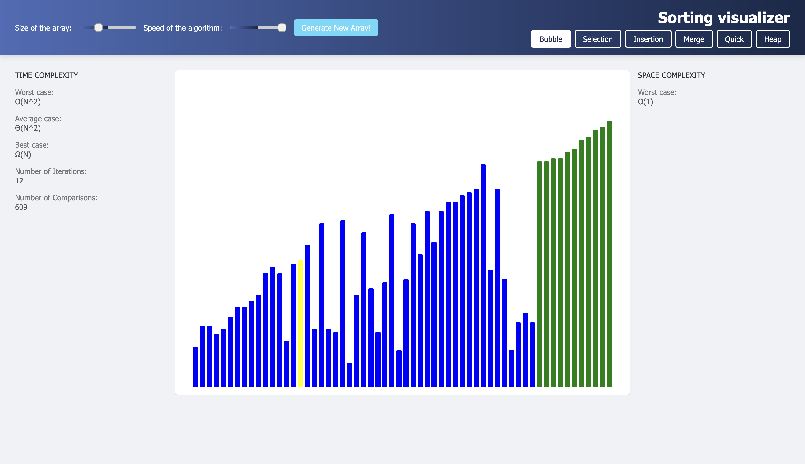
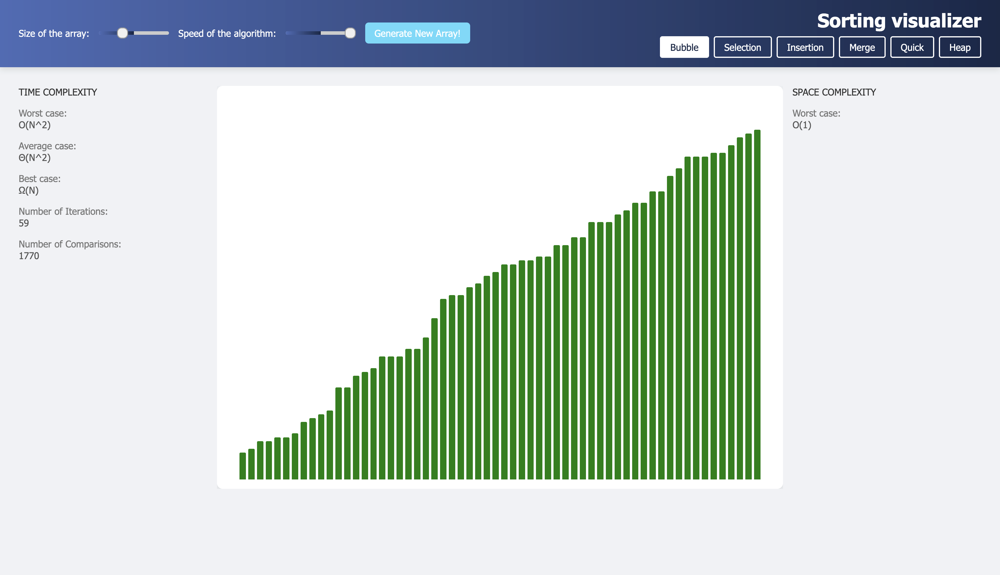

# Sorting_Visualizer
Demo link : https://kartikdnarayanpur.github.io/Sorting_visuvalization/

A web application showcasing the inner workings of sorting algorithms.

Implemented algorithms:
1) Bubble sort
2) Selection sort
3) Insertion sort
4) Merge sort
5) Quick sort
6) Heap sort

Features:
1) Colored representation of step being executed.
  1.1) Blue:default
  1# Sorting Visualizer 🚀

A responsive and dynamic **web application** that visualizes the working of popular **sorting algorithms**.  
This project provides a colorful, real-time visual representation of how elements are sorted step-by-step.

---

## 📚 Implemented Sorting Algorithms

- 🔵 **Bubble Sort**
- 🔵 **Selection Sort**
- 🔵 **Insertion Sort**
- 🔵 **Merge Sort**
- 🔵 **Quick Sort**
- 🔵 **Heap Sort**

---

## 🎨 Features

- **Dynamic Visual Feedback:**
  - **Blue** – Default (Unsorted elements)
  - **Yellow** – Elements currently being compared
  - **Red** – Elements identified to be moved (wrong position)
  - **Green** – Correctly placed elements

- **Control Panel for Visualization:**
  - **Speed Control** — Adjust the visualization speed (5 levels)
  - **Array Size Control** — Change the number of elements being sorted
  - **Generate New Array** — Randomly generate a fresh unsorted array

- **Algorithm Complexity Display:**
  - Displays **Time Complexity** (Best, Average, Worst cases)
  - Displays **Space Complexity**

- **Dynamic Counters (Added Feature):**
  - **Number of Iterations**
  - **Number of Comparisons**

---

## 🛠️ Built With

- **HTML5**
- **CSS3**
- **JavaScript (Vanilla JS)**

---

## 📸 Screenshots

| Initial State | During Sorting |
|:--------------|:----------------|
|  |  |



> *(Optional: You can upload screenshots into a `screenshots/` folder if you want!)*

---

## 🚀 How to Run Locally

1. Clone the repository:
   ```bash
   git clone https://github.com/your-username/Sorting-Visualizer.git.2) Yellow: Being compared
  1.3) Red: Identified as in incorrect position and to be moved
  1.4) Green: In correct position
2) 3 Controls for visualizations
  2.1) Speed of visualization (5 speed levels)
  2.2) Data size ()
  2.3) Generation of new data (Randomly generate new data).
4) Time and Space complexity of algorithm being visualized.


